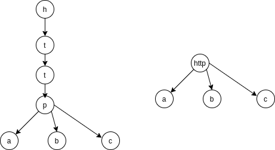

# 数据结构
## 基数树
基数树是字典树的优化版本，将单链压缩到一个节点中，例如：httpa，httpb，httpc组成的字典树前面4个节点h->t->t->p单链表，基数树会压缩相同前缀http成为一个节点，这样就省掉3个节点，并且大大降低树的高度，内存和性能都高于字典树。  


### radix说明
radix的路径是降一级的，即h->i->[] h节点表示"", i节点表示"h" []节点表示"hi"。也就是说叶子节点是完整路径，但是可能size==0
```
typedef struct raxNode {
    uint32_t iskey:1;     /* Does this node contain a key? */
    uint32_t isnull:1;    /* Associated value is NULL (don't store it). */
    uint32_t iscompr:1;   /* Node is compressed. */
    uint32_t size:29;     /* Number of children, or compressed string len. */
    /* 当不压缩的时候，data中有size个子节点,即a...或b...或c...三种路径
     * [header iscompr=0][abc][padding][a-ptr][b-ptr][c-ptr](value-ptr?)
     * 当压缩的时候，data中只有一个子节点,即xyz...只有一种路径
     * [header iscompr=1][xyz][padding][z-ptr](value-ptr?)
     */
    unsigned char data[]; // 柔性数组
} raxNode;

typedef struct rax {
    raxNode *head;
    uint64_t numele;
    uint64_t numnodes;
} rax;
```
`data` 是一个柔性数组，中间存储了元素+对齐+子节点指针+value指针（如果存在的话），因此以下宏要弄明白：  

1.
```
#define raxPadding(nodesize) ((sizeof(void*)-((nodesize+4) % sizeof(void*))) & (sizeof(void*)-1))
```
返回需要添加的对齐内存。以64位为例，nodesize是node->size，例如http就是4。因此我们可以确定4字节的header（sizeof(raxNode)）+ size这一部分要对齐，因此8-(size+4)对8字节取余即可。32位同理。  

2.
```
#define raxNodeCurrentLength(n) ( \
    sizeof(raxNode)+(n)->size+ \
    raxPadding((n)->size)+ \
    ((n)->iscompr ? sizeof(raxNode*) : sizeof(raxNode*)*(n)->size)+ \
    (((n)->iskey && !(n)->isnull)*sizeof(void*)) \
)
```
返回节点长度。压缩：header+size+padding+一个子节点+一个value指针。非压缩：header+size+padding+size个子节点+一个value指针。  

3.
```
#define raxNodeLastChildPtr(n) ((raxNode**) ( \
    ((char*)(n)) + \
    raxNodeCurrentLength(n) - \
    sizeof(raxNode*) - \
    (((n)->iskey && !(n)->isnull) ? sizeof(void*) : 0) \
))
```
返回最后一个子节点指针。节点指针+长度-最后一个子节点指针-value指针  

4.
```
#define raxNodeFirstChildPtr(n) ((raxNode**) ( \
    (n)->data + \
    (n)->size + \
    raxPadding((n)->size)))
```
返回第一个子节点指针。data+size+padding  

**注意：value可能为空，如果为空则内存不包含value。**  
以上几个宏完全说明白了节点内部的内存结构。通过使用柔性数组，内存利用非常高效便捷。

### 初始化
```
// 直接包含了一个header，但是header中没有key，没有value
rax *raxNew(void) {
    rax *rax = rax_malloc(sizeof(*rax));
    if (rax == NULL) return NULL;
    rax->numele = 0;
    rax->numnodes = 1;
    rax->head = raxNewNode(0,0);
    if (rax->head == NULL) {
        rax_free(rax);
        return NULL;
    } else {
        return rax;
    }
}

/* Set the node auxiliary data to the specified pointer. */
void raxSetData(raxNode *n, void *data) {
    n->iskey = 1;
    if (data != NULL) {
        n->isnull = 0;
        void **ndata = (void**)
            ((char*)n+raxNodeCurrentLength(n)-sizeof(void*));
        // 这里*ndata = data也可以
        memcpy(ndata,&data,sizeof(data));
    } else {
        n->isnull = 1;
    }
}

/* Get the node auxiliary data. */
void *raxGetData(raxNode *n) {
    if (n->isnull) return NULL;
    void **ndata =(void**)((char*)n+raxNodeCurrentLength(n)-sizeof(void*));
    void *data;
    memcpy(&data,ndata,sizeof(data));
    return data;
}
```
基数树中存储的全部是指针。

### 查找
无论是插入还是删除都需要使用到查找
```
// 此函数查找s，返回停止查找的节点即不匹配的节点，返回值为s匹配的字节数
static inline size_t raxLowWalk(rax *rax, unsigned char *s, size_t len, raxNode **stopnode, raxNode ***plink, int *splitpos, raxStack *ts) {
    raxNode *h = rax->head;
    // parentlink存储h节点的父亲例如：h->i->[],若h==[],则存储的是*(i+raxNodeLastChildPtr(i)) == h
    raxNode **parentlink = &rax->head;

    size_t i = 0; /* Position in the string. */
    size_t j = 0; /* Position in the node children (or bytes if compressed).*/
    while(h->size && i < len) {
        debugnode("Lookup current node",h);
        unsigned char *v = h->data;

        if (h->iscompr) {
            // 如果是压缩的，就与h节点中的数据逐个对比
            for (j = 0; j < h->size && i < len; j++, i++) {
                if (v[j] != s[i]) break;
            }
            // 不是完全相同，直接返回，因为是压缩的，这里j就是要分割此压缩节点的地方
            // 完全相同，继续子节点查找
            if (j != h->size) break;
        } else {
            // 如果不是压缩的，有一个相同即可，继续遍历第j个子节点
            for (j = 0; j < h->size; j++) {
                if (v[j] == s[i]) break;
            }
            // j==h->size 没有一个相同，直接返回，完全不匹配
            // 否则有相同的，继续子节点，并s的下一位继续匹配
            if (j == h->size) break;
            i++;
        }

        if (ts) raxStackPush(ts,h); /* Save stack of parent nodes. */
        // 获取子节点
        raxNode **children = raxNodeFirstChildPtr(h);
        if (h->iscompr) j = 0;
        memcpy(&h,children+j,sizeof(h));
        // parentlink永远指向h,永远是父节点内存的一个指向h的指针
        parentlink = children+j;
        j = 0; /* If the new node is non compressed and we do not
                  iterate again (since i == len) set the split
                  position to 0 to signal this node represents
                  the searched key. */
    }
    debugnode("Lookup stop node is",h);
    if (stopnode) *stopnode = h;
    if (plink) *plink = parentlink;
    if (splitpos && h->iscompr) *splitpos = j;
    return i;
}

void *raxFind(rax *rax, unsigned char *s, size_t len) {
    raxNode *h;

    debugf("### Lookup: %.*s\n", (int)len, s);
    int splitpos = 0;
    size_t i = raxLowWalk(rax,s,len,&h,NULL,&splitpos,NULL);
    // i不等于len 代表没有完全匹配  匹配到的h是压缩的，并且分割点不等于0，代表key不存在
    if (i != len || (h->iscompr && splitpos != 0) || !h->iskey)
        return raxNotFound;
    return raxGetData(h);
}
```
### 插入
```
int raxGenericInsert(rax *rax, unsigned char *s, size_t len, void *data, void **old, int overwrite) {
    size_t i;
    int j = 0;
    raxNode *h, **parentlink;

    debugf("### Insert %.*s with value %p\n", (int)len, s, data);
    i = raxLowWalk(rax,s,len,&h,&parentlink,&j,NULL);

    /* 如果s遍历结束，并且返回的不是压缩节点 或者 压缩节点为匹配后的子节点 */
    // 返回的节点即为完全匹配s后的节点，应该存储s的value的节点
    if (i == len && (!h->iscompr || j == 0 )) {
        debugf("### Insert: node representing key exists\n");
        /* 分配空间 */
        // key不存在或为null说明都没有分配value空间
        if (!h->iskey || (h->isnull && overwrite)) {
            h = raxReallocForData(h,data);
            if (h) memcpy(parentlink,&h,sizeof(h));
        }
        if (h == NULL) {
            errno = ENOMEM;
            return 0;
        }

        if (h->iskey) {
            if (old) *old = raxGetData(h);
            if (overwrite) raxSetData(h,data);
            errno = 0;
            return 0; /* Element already exists. */
        }

        // key不存在(可能以前存在，被删除了)
        raxSetData(h,data);
        rax->numele++;
        return 1; /* Element inserted. */
    }
    /* ------------------------- ALGORITHM 1 --------------------------- */
    // 返回的压缩节点，并且没有遍历完s。
    // 两种情况：h->iredis->[] 插入 his.  h->iredis->[] 插入 hs
    if (h->iscompr && i != len) {
        /* 1: Save next pointer. */
        raxNode **childfield = raxNodeLastChildPtr(h);
        raxNode *next;
        memcpy(&next,childfield,sizeof(next));

        // 假如：h->iredis->[] 插入 hs，分割点的idx。
        size_t trimmedlen = j;
        size_t postfixlen = h->size - j - 1;
        int split_node_is_key = !trimmedlen && h->iskey && !h->isnull;
        size_t nodesize;

        raxNode *splitnode = raxNewNode(1, split_node_is_key);
        raxNode *trimmed = NULL;
        raxNode *postfix = NULL;

        if (trimmedlen) {
            // 分配 分割点前的node 即原来数据分割点前的数据 "i"
            nodesize = sizeof(raxNode)+trimmedlen+raxPadding(trimmedlen)+
                       sizeof(raxNode*);
            if (h->iskey && !h->isnull) nodesize += sizeof(void*);
            trimmed = rax_malloc(nodesize);
        }

        if (postfixlen) {
            // 分配 分割点后的node 即原来数据分割点后的数据 "edis"
            nodesize = sizeof(raxNode)+postfixlen+raxPadding(postfixlen)+
                       sizeof(raxNode*);
            postfix = rax_malloc(nodesize);
        }

        // out of memory
        if (splitnode == NULL ||
            (trimmedlen && trimmed == NULL) ||
            (postfixlen && postfix == NULL))
        {
            rax_free(splitnode);
            rax_free(trimmed);
            rax_free(postfix);
            errno = ENOMEM;
            return 0;
        }
        // data分割点的数据赋值给 分割点节点 "r"
        splitnode->data[0] = h->data[j];

        if (j == 0) {
            /* 3a: Replace the old node with the split node. */
            if (h->iskey) {
                void *ndata = raxGetData(h);
                raxSetData(splitnode,ndata);
            }
            // 拼接 不存在分割前node，直接本身放在父节点就行了
            memcpy(parentlink,&splitnode,sizeof(splitnode));
        } else {
            /* 3b: Trim the compressed node. */
            trimmed->size = j;
            // h分割点前的数据赋值给分割前的node
            memcpy(trimmed->data,h->data,j);
            trimmed->iscompr = j > 1 ? 1 : 0;
            trimmed->iskey = h->iskey;
            trimmed->isnull = h->isnull;
            if (h->iskey && !h->isnull) {
                // 因为是分割点前的，因此h存储的是h父节点路径的数据，现在需要存入到分割点前node中。
                void *ndata = raxGetData(h);
                raxSetData(trimmed,ndata);
            }
            // 拼接 分割点放在分割点前node
            raxNode **cp = raxNodeLastChildPtr(trimmed);
            memcpy(cp,&splitnode,sizeof(splitnode));
            // 拼接 父节点的子节点指针 指向 分割点前node
            memcpy(parentlink,&trimmed,sizeof(trimmed));
            parentlink = cp; /* Set parentlink to splitnode parent. */
            rax->numnodes++;
        }

        if (postfixlen) {
            /* 分割后的node */
            postfix->iskey = 0;
            postfix->isnull = 0;
            postfix->size = postfixlen;
            postfix->iscompr = postfixlen > 1;
            // h分割点后的数据赋值给分割后的node
            memcpy(postfix->data,h->data+j+1,postfixlen);
            raxNode **cp = raxNodeLastChildPtr(postfix);
            // h以前的子节点指针给分割后的节点
            memcpy(cp,&next,sizeof(next));
            rax->numnodes++;
        } else {
            /* 4b: just use next as postfix node. */
            postfix = next;
        }

        // 分割后的节点拼接到分割节点上
        raxNode **splitchild = raxNodeLastChildPtr(splitnode);
        memcpy(splitchild,&postfix,sizeof(postfix));

        /* 6. Continue insertion: this will cause the splitnode to
         * get a new child (the non common character at the currently
         * inserted key). */
        rax_free(h);
        h = splitnode;
    } else if (h->iscompr && i == len) {
    /* ------------------------- ALGORITHM 2 --------------------------- */
        // s遍历结束，路径存在，压缩节点需要打断，不需要分割
        debugf("ALGO 2: Stopped at compressed node %.*s (%p) j = %d\n",
            h->size, h->data, (void*)h, j);

        size_t postfixlen = h->size - j;
        // j打断前的节点
        size_t nodesize = sizeof(raxNode)+postfixlen+raxPadding(postfixlen)+
                          sizeof(raxNode*);
        if (data != NULL) nodesize += sizeof(void*);
        raxNode *postfix = rax_malloc(nodesize);

        // j打断后的节点
        nodesize = sizeof(raxNode)+j+raxPadding(j)+sizeof(raxNode*);
        if (h->iskey && !h->isnull) nodesize += sizeof(void*);
        raxNode *trimmed = rax_malloc(nodesize);

        if (postfix == NULL || trimmed == NULL) {
            rax_free(postfix);
            rax_free(trimmed);
            errno = ENOMEM;
            return 0;
        }

        /* 1: Save next pointer. */
        raxNode **childfield = raxNodeLastChildPtr(h);
        raxNode *next;
        memcpy(&next,childfield,sizeof(next));

        /* 2: Create the postfix node. */
        postfix->size = postfixlen;
        postfix->iscompr = postfixlen > 1;
        postfix->iskey = 1;
        postfix->isnull = 0;
        // h打断后的存储到postfix
        memcpy(postfix->data,h->data+j,postfixlen);
        raxSetData(postfix,data);
        raxNode **cp = raxNodeLastChildPtr(postfix);
        // h的next存储到postfix的next
        memcpy(cp,&next,sizeof(next));
        rax->numnodes++;

        /* 3: Trim the compressed node. */
        trimmed->size = j;
        trimmed->iscompr = j > 1;
        trimmed->iskey = 0;
        trimmed->isnull = 0;
        // h打断前的存储到trimmed
        memcpy(trimmed->data,h->data,j);
        // h的父节点指向trimmed 相当于h已经被unlink了
        memcpy(parentlink,&trimmed,sizeof(trimmed));
        if (h->iskey) {
            // 父节点修改，h的父的路径的value 存入到trimmed
            void *aux = raxGetData(h);
            raxSetData(trimmed,aux);
        }

        /* Fix the trimmed node child pointer to point to
         * the postfix node. */
        // 拼接 trimmed->child = postfix
        cp = raxNodeLastChildPtr(trimmed);
        memcpy(cp,&postfix,sizeof(postfix));

        /* Finish! We don't need to continue with the insertion
         * algorithm for ALGO 2. The key is already inserted. */
        rax->numele++;
        rax_free(h);
        // 不需要往下了 s没有剩下的数据
        return 1; /* Key inserted. */
    }

    // 处理s剩下的数据，该压缩的压缩，该新增的新增。
    // 如果h是非压缩节点，直接在这里处理就可以了
    while(i < len) {
        raxNode *child;
        if (h->size == 0 && len-i > 1) {
            debugf("Inserting compressed node\n");
            size_t comprsize = len-i;
            if (comprsize > RAX_NODE_MAX_SIZE)
                comprsize = RAX_NODE_MAX_SIZE;
            raxNode *newh = raxCompressNode(h,s+i,comprsize,&child);
            if (newh == NULL) goto oom;
            h = newh;
            memcpy(parentlink,&h,sizeof(h));
            parentlink = raxNodeLastChildPtr(h);
            i += comprsize;
        } else {
            debugf("Inserting normal node\n");
            raxNode **new_parentlink;
            raxNode *newh = raxAddChild(h,s[i],&child,&new_parentlink);
            if (newh == NULL) goto oom;
            h = newh;
            memcpy(parentlink,&h,sizeof(h));
            parentlink = new_parentlink;
            i++;
        }
        rax->numnodes++;
        h = child;
    }
    raxNode *newh = raxReallocForData(h,data);
    if (newh == NULL) goto oom;
    h = newh;
    if (!h->iskey) rax->numele++;
    raxSetData(h,data);
    memcpy(parentlink,&h,sizeof(h));
    return 1; /* Element inserted. */

oom:
    /* This code path handles out of memory after part of the sub-tree was
     * already modified. Set the node as a key, and then remove it. However we
     * do that only if the node is a terminal node, otherwise if the OOM
     * happened reallocating a node in the middle, we don't need to free
     * anything. */
    if (h->size == 0) {
        h->isnull = 1;
        h->iskey = 1;
        rax->numele++; /* Compensate the next remove. */
        assert(raxRemove(rax,s,i,NULL) != 0);
    }
    errno = ENOMEM;
    return 0;
}
```
radix的插入及其复杂，因为redis为了内存高效利用，每个entry都是整块内存，插入被分为三种情况：  
1. h压缩节点，并且没有遍历完s，需要分割h
2. h压缩节点，s遍历结束，只需要打断h
3. h为非压缩节点，内存不用调整，newNode插入调整父子指针即可。

### 删除
```
// 删除函数
int raxRemove(rax *rax, unsigned char *s, size_t len, void **old) {
    raxNode *h;
    raxStack ts;

    debugf("### Delete: %.*s\n", (int)len, s);
    raxStackInit(&ts);
    int splitpos = 0;
    // 找s经过的entry存到stack里面
    size_t i = raxLowWalk(rax,s,len,&h,NULL,&splitpos,&ts);
    if (i != len || (h->iscompr && splitpos != 0) || !h->iskey) {
        // 没找到s
        raxStackFree(&ts);
        return 0;
    }
    if (old) *old = raxGetData(h);
    // 不在是个key
    h->iskey = 0;
    rax->numele--;

    int trycompress = 0;

    if (h->size == 0) {
        // 删除叶子节点，通过stack遍历，如果父母不是key或者只有一个child（被删除那个），继续删除。
        debugf("Key deleted in node without children. Cleanup needed.\n");
        raxNode *child = NULL;
        while(h != rax->head) {
            child = h;
            debugf("Freeing child %p [%.*s] key:%d\n", (void*)child,
                (int)child->size, (char*)child->data, child->iskey);
            rax_free(child);
            rax->numnodes--;
            h = raxStackPop(&ts);
             /* If this node has more then one child, or actually holds
              * a key, stop here. */
            if (h->iskey || (!h->iscompr && h->size != 1)) break;
        }
        if (child) {
            debugf("Unlinking child %p from parent %p\n",
                (void*)child, (void*)h);
            // 最后一个释放的child从树中移除
            raxNode *new = raxRemoveChild(h,child);
            if (new != h) {
                // 如果child有孩子，连接上 （暂时没想到是什么情况会出现，因为我们前提是h->size==0才删除，遍历往上删除）
                raxNode *parent = raxStackPeek(&ts);
                raxNode **parentlink;
                if (parent == NULL) {
                    parentlink = &rax->head;
                } else {
                    parentlink = raxFindParentLink(parent,h);
                }
                memcpy(parentlink,&new,sizeof(new));
            }

            // 如果删除的节点只有一个子节点，并且不是一个key，尝试压缩。例如:
            // foo->b->ar->[] 删除foobr，首先删除节点[]，然后删除节点ar中的r,
            // 此时发现a不是个key并且只有一个子节点
            if (new->size == 1 && new->iskey == 0) {
                trycompress = 1;
                h = new;
            }
        }
    } else if (h->size == 1) {
        /* 节点本来就只有一个子节点，删除子节点后，尝试与父节点压缩 */
        trycompress = 1;
    }

    if (trycompress && ts.oom) trycompress = 0;

     /* 两种官方举例的条件
     * 1) A node with a single child was a key and now no longer is a key.
     * 2) A node with two children now has just one child.

     * Example of case "1". A tree stores the keys "FOO" = 1 and
     * "FOOBAR" = 2:
     *
     * "FOO" -> "BAR" -> [] (2)
     *           (1)
     * After the removal of "FOO" the tree can be compressed as:
     *
     * "FOOBAR" -> [] (2)
     *
     * Example of case "2". A tree stores the keys "FOOBAR" = 1 and
     * "FOOTER" = 2:
     *
     *          |B| -> "AR" -> [] (1)
     * "FOO" -> |-|
     *          |T| -> "ER" -> [] (2)
     *
     * After the removal of "FOOTER" the resulting tree is:
     *
     * "FOO" -> |B| -> "AR" -> [] (1)
     *
     * That can be compressed into:
     *
     * "FOOBAR" -> [] (1)
     */
    if (trycompress) {
        debugf("After removing %.*s:\n", (int)len, s);
        debugnode("Compression may be needed",h);
        debugf("Seek start node\n");

        /* 如果父不是key并且非压缩节点只有一个子节点，能继续压缩 */
        raxNode *parent;
        while(1) {
            parent = raxStackPop(&ts);
            if (!parent || parent->iskey ||
                (!parent->iscompr && parent->size != 1)) break;
            h = parent;
            debugnode("Going up to",h);
        }
        raxNode *start = h; /* Compression starting node. */

        /* Scan chain of nodes we can compress. */
        size_t comprsize = h->size;
        int nodes = 1;
        while(h->size != 0) {
            raxNode **cp = raxNodeLastChildPtr(h);
            memcpy(&h,cp,sizeof(h));
            if (h->iskey || (!h->iscompr && h->size != 1)) break;
            if (comprsize + h->size > RAX_NODE_MAX_SIZE) break;
            nodes++;
            // 记录能压缩的size和节点数
            comprsize += h->size;
        }
        if (nodes > 1) {
            // 创建压缩节点
            size_t nodesize =
                sizeof(raxNode)+comprsize+raxPadding(comprsize)+sizeof(raxNode*);
            raxNode *new = rax_malloc(nodesize);
            if (new == NULL) {
                raxStackFree(&ts);
                return 1;
            }
            new->iskey = 0;
            new->isnull = 0;
            new->iscompr = 1;
            new->size = comprsize;
            rax->numnodes++;

            comprsize = 0;
            h = start;
            while(h->size != 0) {
                // 从能开始压缩的根开始，往new里面填数据 直到叶子节点
                memcpy(new->data+comprsize,h->data,h->size);
                comprsize += h->size;
                raxNode **cp = raxNodeLastChildPtr(h);
                raxNode *tofree = h;
                memcpy(&h,cp,sizeof(h));
                rax_free(tofree); rax->numnodes--;
                if (h->iskey || (!h->iscompr && h->size != 1)) break;
            }
            // 处理上面循环结束的叶子节点
            raxNode **cp = raxNodeLastChildPtr(new);
            memcpy(cp,&h,sizeof(h));

            // 压缩节点添加到列表
            if (parent) {
                raxNode **parentlink = raxFindParentLink(parent,start);
                memcpy(parentlink,&new,sizeof(new));
            } else {
                rax->head = new;
            }

            debugf("Compressed %d nodes, %d total bytes\n",
                nodes, (int)comprsize);
        }
    }
    raxStackFree(&ts);
    return 1;
}
```
删除函数有时候并不是真的直接删除，可能仅仅是将iskey=0，例如：空树 先插入 "foo" ，再插入 "bar"，则foo->bar->[] 然后删除"foo"，根据判断条件此时h为bar节点，不进行任何操作。理想情况应该为:foobar->[] 合并一次节点。

## 总结
radix通过每个entry一块完整内存可以高效寻址利用内存，并且通过压缩来节省空间提高性能（降低树的高度），但是可以看到删除时有些判断条件会进行伪删除，不知是不是为了减少压缩次数，统一压缩来提高性能。  
radix原理比较简单，但是为了高效，实现极其复杂，尤其是遍历通过parentlink存储上一节点的指向子节点的内存地址，然后memcpy来进行父子关系的改变，理解起来还是有一定难度。
