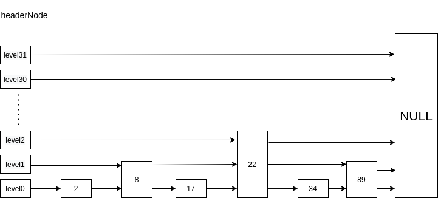

# 数据结构
## 跳表
增加多层索引的链表结构  

### skiplist
跳表，多层链表。从顶到下，节点数量越来越多，遍历从顶开始跳跃，算法思想类于二分法
```
/* ZSETs use a specialized version of Skiplists */
typedef struct zskiplistNode {
    sds ele; // 存储的数据
    double score; // 分数 用户传入 依此排序
    struct zskiplistNode *backward; // 当前节点的前一个节点 只存在于0层
    struct zskiplistLevel {
        struct zskiplistNode *forward; // 当前节点的当前层(level的idx为第几层)的下一个节点
        unsigned long span; // 到下一个节点的距离(n到m的距离即0层的m-n+1)
    } level[]; // 层 数组，除0层外，其它层不存储实际数据
} zskiplistNode;

typedef struct zskiplist {
    struct zskiplistNode *header, *tail; // 头尾指针
    unsigned long length; // 链表长度
    int level; // 总层数
} zskiplist;
```
#### 创建和释放
```
zskiplistNode *zslCreateNode(int level, double score, sds ele);

zskiplist *zslCreate(void) {
    int j;
    zskiplist *zsl;

    zsl = zmalloc(sizeof(*zsl));
    zsl->level = 1;
    zsl->length = 0;
    // ZSKIPLIST_MAXLEVEL==32 header直接是32层，不存储任何数据
    zsl->header = zslCreateNode(ZSKIPLIST_MAXLEVEL,0,NULL);
    for (j = 0; j < ZSKIPLIST_MAXLEVEL; j++) {
        zsl->header->level[j].forward = NULL;
        zsl->header->level[j].span = 0;
    }
    zsl->header->backward = NULL;
    zsl->tail = NULL;
    return zsl;
}

// 注意 这里释放了sds，如果不想被释放，将ele = null，自己释放
void zslFreeNode(zskiplistNode *node) {
    sdsfree(node->ele);
    zfree(node);
}

void zslFree(zskiplist *zsl);
```
这里只需要注意ele的释放问题即可。
#### 插入和删除

##### 插入
```
// 通过随机生成新节点的层数，可以避免跳表退化成链表，返回数越大，概率越小，保证越上层的节点越少，否则效率不高（上层level节点数量大于等于低层的话，不具备跳跃功能了，这一层就没有任何意义了）。ZSKIPLIST_P == 0.25 （算法证明不懂）
int zslRandomLevel(void) {
    int level = 1;
    while ((random()&0xFFFF) < (ZSKIPLIST_P * 0xFFFF))
        level += 1;
    return (level<ZSKIPLIST_MAXLEVEL) ? level : ZSKIPLIST_MAXLEVEL;
}

// 作为有序集合，需要调用者来保证要插入的元素不存在
zskiplistNode *zslInsert(zskiplist *zsl, double score, sds ele) {
    zskiplistNode *update[ZSKIPLIST_MAXLEVEL], *x;
    unsigned int rank[ZSKIPLIST_MAXLEVEL];
    int i, level;

    serverAssert(!isnan(score));
    x = zsl->header;
    // 从顶到小，计算要插入节点在每一层的位置，记录每一层此节点前的节点以及偏移(m-0)，只有小于zsl->level的层才有节点，因此不需要从31层开始查找
    // 如上图，如果要插入50，则update[2]记录节点22，rank[2]=4，22节点前一节点到22的跳跃span。  
    // 依次则update[1]=Node(22),rank[1]=4,update[0]=Node(34),rank[0]=5
    for (i = zsl->level-1; i >= 0; i--) {
        // 从当前链表的最大层开始（不是32，而是存在的最大层，如图中level==3）
        rank[i] = i == (zsl->level-1) ? 0 : rank[i+1];
        // 下一节点存在即不是这一层的尾节点，score小于要插入节点的score（score可以相同，会比较ele）
        while (x->level[i].forward &&
                (x->level[i].forward->score < score ||
                    (x->level[i].forward->score == score &&
                    sdscmp(x->level[i].forward->ele,ele) < 0)))
        {
            // 累加，即要插入节点的位置的前一个节点，相对于链表头的此层的跳跃数
            rank[i] += x->level[i].span;
            x = x->level[i].forward;
        }
        // 找到此层要插入节点的位置的前一个节点
        update[i] = x;
    }
    // 作者在这里再次强调插入的元素score可以相同，但是元素被假设不能相同，需要调用者来保证  
    // 获取随机层数
    level = zslRandomLevel();
    // 若层数大于当前链表的最大层数，则生成层数
    if (level > zsl->level) {
        for (i = zsl->level; i < level; i++) {
            rank[i] = 0;
            update[i] = zsl->header;
            update[i]->level[i].span = zsl->length;
        }
        zsl->level = level;
    }
    x = zslCreateNode(level,score,ele);
    // 从0层往随机生成的层数插入
    for (i = 0; i < level; i++) {
        // 节点插入
        x->level[i].forward = update[i]->level[i].forward;
        update[i]->level[i].forward = x;

        // 插入后 更新插入节点的跳跃数，以及前一个节点的跳跃数  
        // rank[i]是x节点在i层相对于链表头的跳跃数，0层有所有元素，因此rank[0]-ran[i]即为x节点在第i层与前一个节点的span
        // prev到next的跳跃数 - prev到x的跳跃数 = x到next的跳跃数 即为x在此层的span
        x->level[i].span = update[i]->level[i].span - (rank[0] - rank[i]);
        //
        update[i]->level[i].span = (rank[0] - rank[i]) + 1;
    }

    // x节点以上的每一层的都要+1，因为新插入了x，0层的相对距离+1
    for (i = level; i < zsl->level; i++) {
        update[i]->level[i].span++;
    }

    // 这里要注意如果x插入到了header之后，x的前指针指向的是NULL，而不是header
    x->backward = (update[0] == zsl->header) ? NULL : update[0];
    // 0层是双向链表
    if (x->level[0].forward)
        x->level[0].forward->backward = x;
    else
        zsl->tail = x;
    zsl->length++;
    return x;
}
```
插入算法先计算每一层的要插入的位置，再进行插入，再修改前一节点的跳跃数。
##### 删除
```
void zslDeleteNode(zskiplist *zsl, zskiplistNode *x, zskiplistNode **update) {
    int i;
    // 与插入相反
    for (i = 0; i < zsl->level; i++) {
        if (update[i]->level[i].forward == x) {
            update[i]->level[i].span += x->level[i].span - 1;
            update[i]->level[i].forward = x->level[i].forward;
        } else {
            update[i]->level[i].span -= 1;
        }
    }
    // 0层是双向链表
    if (x->level[0].forward) {
        x->level[0].forward->backward = x->backward;
    } else {
        zsl->tail = x->backward;
    }
    // 如果header下一个节点是NULL，说明这层没有节点了，干掉
    while(zsl->level > 1 && zsl->header->level[zsl->level-1].forward == NULL)
        zsl->level--;
    zsl->length--;
}

// 从链表中删除匹配score/ele的节点，如果存在并且删除，返回1。不存在返回0
// 如果参数node为NULL，则直接释放节点（包括ele），否则仅仅是将节点从链表移除，节点本身不释放，赋值给node，供调用者使用，调用者必须自己释放
int zslDelete(zskiplist *zsl, double score, sds ele, zskiplistNode **node) {
    zskiplistNode *update[ZSKIPLIST_MAXLEVEL], *x;
    int i;
    // 与插入区别不大，找到每层的前节点
    x = zsl->header;
    for (i = zsl->level-1; i >= 0; i--) {
        while (x->level[i].forward &&
                (x->level[i].forward->score < score ||
                    (x->level[i].forward->score == score &&
                     sdscmp(x->level[i].forward->ele,ele) < 0)))
        {
            x = x->level[i].forward;
        }
        update[i] = x;
    }
    // 前一节点的下一节点，检查是否与传入参数相同，相同就删除
    x = x->level[0].forward;
    if (x && score == x->score && sdscmp(x->ele,ele) == 0) {
        zslDeleteNode(zsl, x, update);
        if (!node)
            zslFreeNode(x);
        else
            *node = x;
        return 1;
    }
    return 0; /* not found */
}
```
删除与插入算法的思想一样，代码也非常相似。删除还有范围删除
```
/* Struct to hold an inclusive/exclusive range spec by score comparison. */
typedef struct {
    double min, max;
    int minex, maxex; // mixex ? 左闭 ： 左开， maxex同理
} zrangespec;

// 这个函数需要用到dict，要从dict中也删除此元素，此函数其实是zset使用
unsigned long zslDeleteRangeByScore(zskiplist *zsl, zrangespec *range, dict *dict) {
    zskiplistNode *update[ZSKIPLIST_MAXLEVEL], *x;
    unsigned long removed = 0;
    int i;

    // 根据score获取范围的前一个节点，与插入相同，仅仅是判断条件不同
    x = zsl->header;
    for (i = zsl->level-1; i >= 0; i--) {
        while (x->level[i].forward &&
            !zslValueGteMin(x->level[i].forward->score, range))
                x = x->level[i].forward;
        update[i] = x;
    }

    /* Current node is the last with score < or <= min. */
    x = x->level[0].forward;

    // 从找到的节点往后遍历，不大于max的 全部删除
    while (x && zslValueLteMax(x->score, range)) {
        zskiplistNode *next = x->level[0].forward;
        // 从链表中移除x，并更新链表
        zslDeleteNode(zsl,x,update);
        // 从字典中删除
        dictDelete(dict,x->ele);
        // 释放x
        zslFreeNode(x); /* Here is where x->ele is actually released. */
        removed++;
        x = next;
    }
    return removed;
}
```
更新以及其他范围删除的函数与以score范围删除基本相同。  
## 总结
跳表主要点就在随机层数和插入删除，其余操作与插入基本相同，redis的跳表比实际意义的跳表多了span，可以方便的进行范围操作。  
作者多次强调调用者来保证元素的唯一性，从代码来看是可以插入相同元素的。以下是作者注释:
```
* This skiplist implementation is almost a C translation of the original
* algorithm described by William Pugh in "Skip Lists: A Probabilistic
* Alternative to Balanced Trees", modified in three ways:
* a) this implementation allows for repeated scores.
* b) the comparison is not just by key (our 'score') but by satellite data.
* c) there is a back pointer, so it's a doubly linked list with the back
* pointers being only at "level 1". This allows to traverse the list
* from tail to head, useful for ZREVRANGE. */
```
